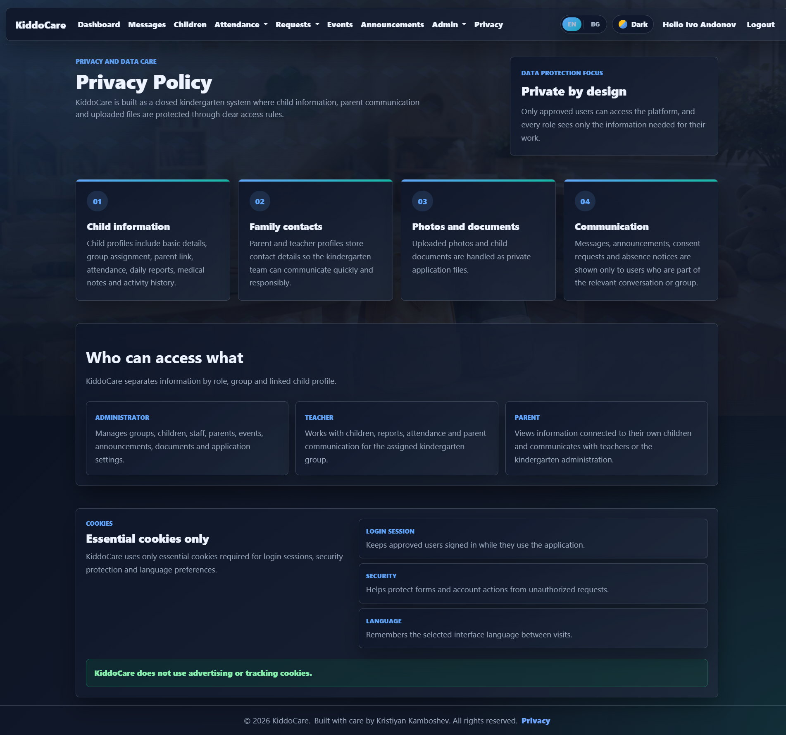
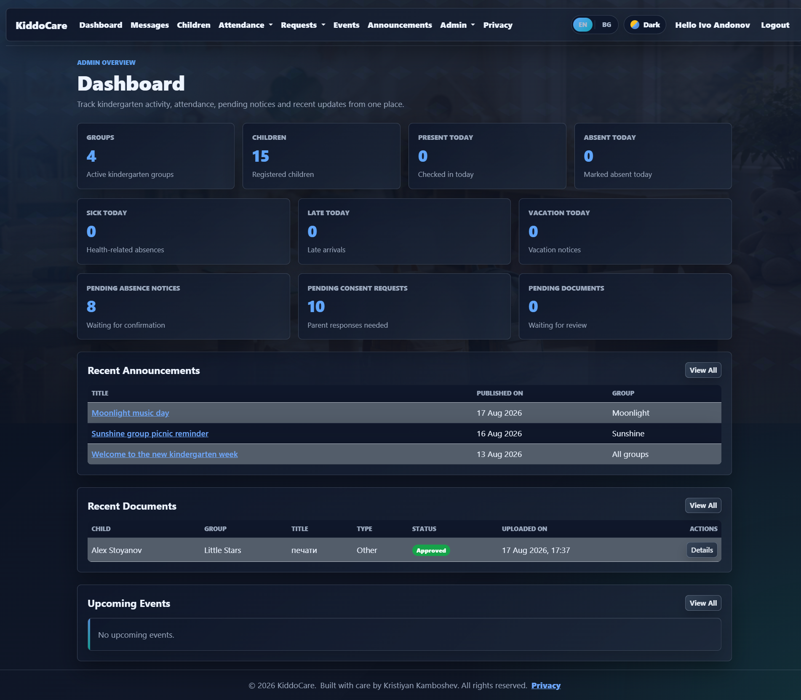
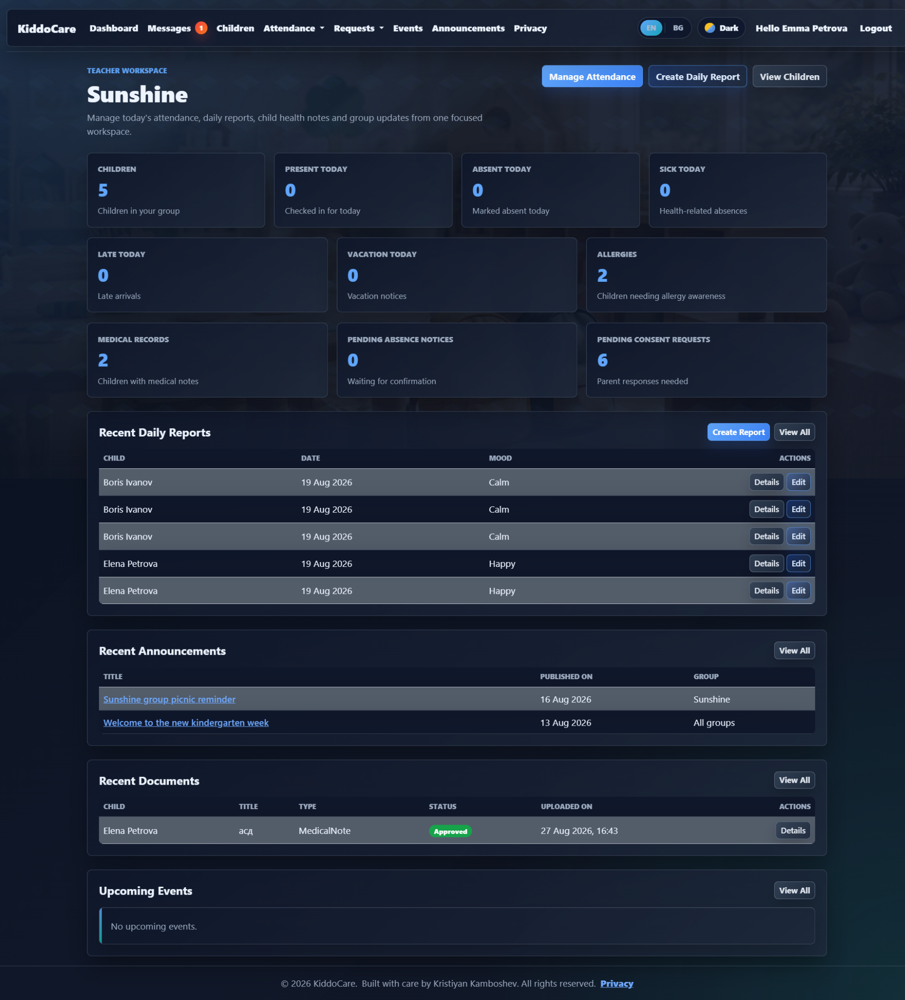
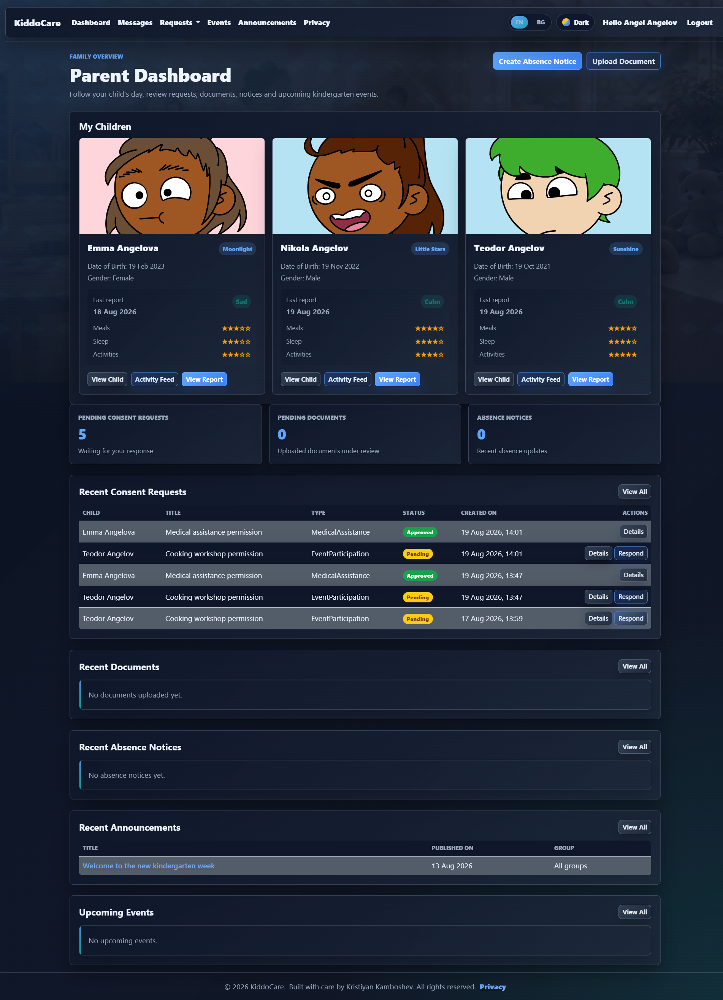
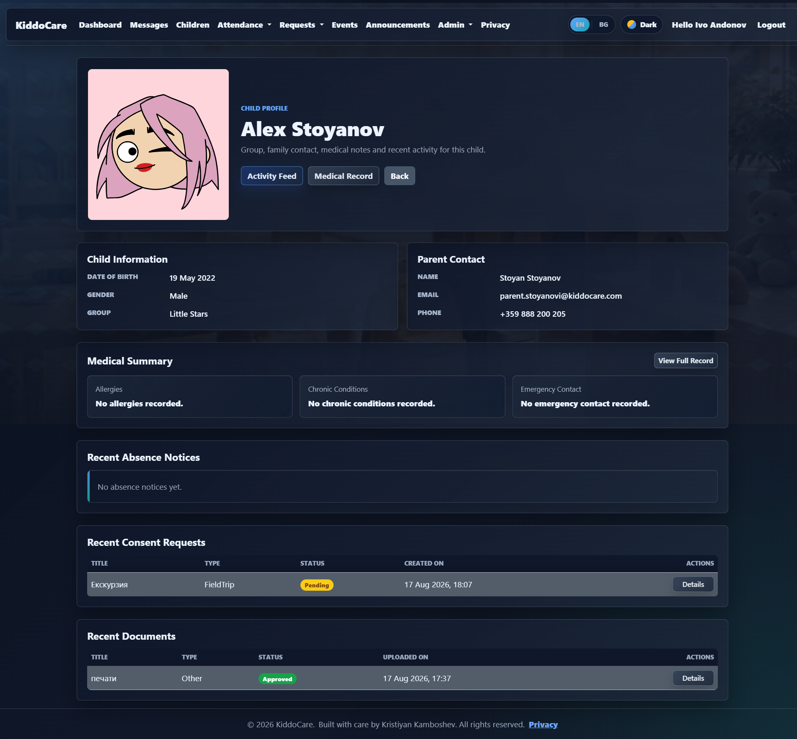
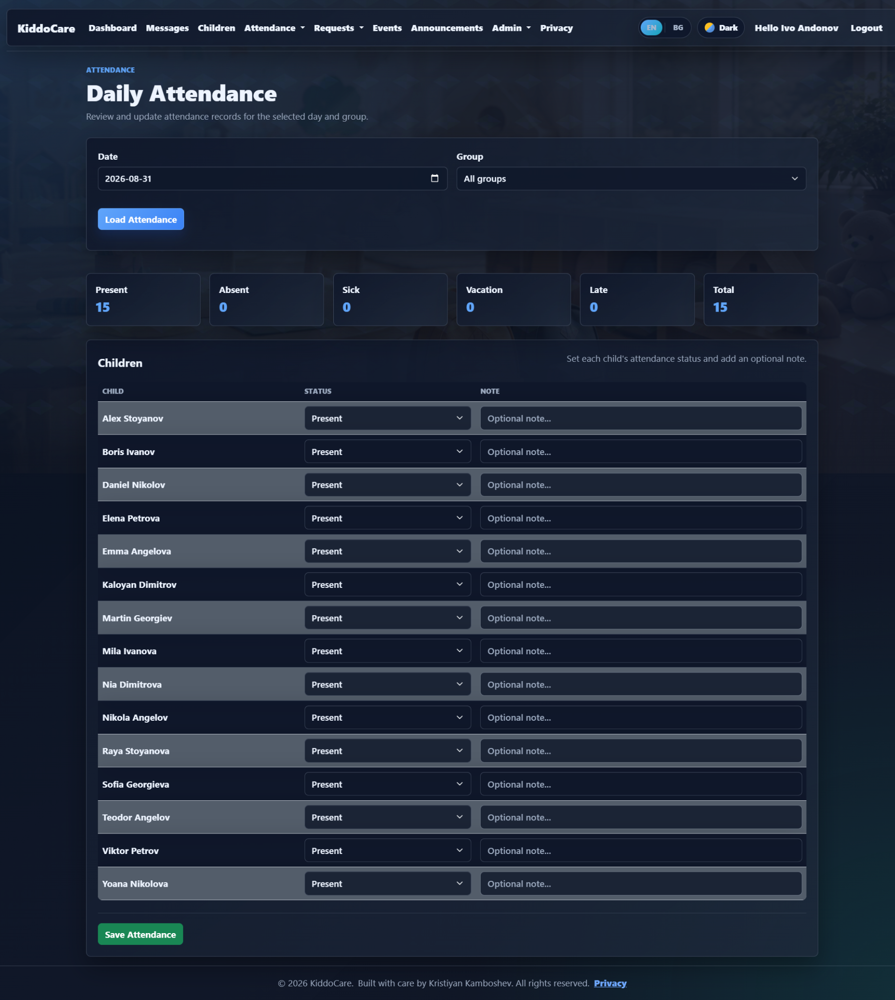
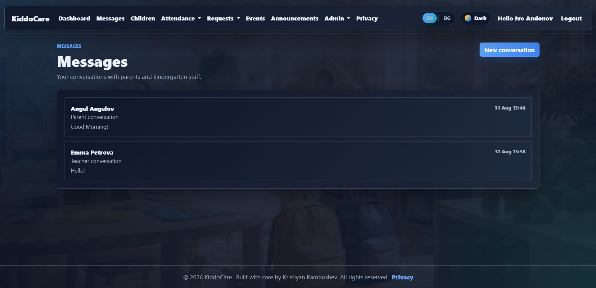

# KiddoCare

<p align="center">
  <strong>A kindergarten management platform built with ASP.NET Core MVC and .NET 10.</strong>
</p>

<p align="center">
  <a href="https://github.com/Kristiyan9359/KiddoCare">
    
  </a>
  
  
  
  
  
</p>

<p align="center">
  <a href="#overview">Overview</a> ·
  <a href="#features">Features</a> ·
  <a href="#roles--access-control">Roles</a> ·
  <a href="#security">Security</a> ·
  <a href="#architecture">Architecture</a> ·
  <a href="#screenshots">Screenshots</a> ·
  <a href="#local-development">Setup</a> ·
  <a href="#testing">Testing</a>
</p>

---

## Overview

**KiddoCare** is a role-based kindergarten management web application designed to connect **administrators, teachers, and parents** around the day-to-day care of children.

The application brings operational information into one place: child profiles, attendance, daily reports, medical information, documents, events, announcements, absence notices, consent requests, activity history, and private conversations.

The project is intentionally built as a **realistic multi-role business application**, with access decisions based not only on the user's role, but also on the user's relationship to the requested data.

> **Portfolio note:** KiddoCare is a demonstration project and uses fictional/demo data. It is not intended for real kindergarten operations or real children's personal data.

## Why KiddoCare?

The main goal of the project is to demonstrate how a complete ASP.NET Core application can be structured beyond basic CRUD:

- multiple user roles with different capabilities;
- business-level authorization and ownership rules;
- service-layer business logic;
- Entity Framework Core and SQL Server persistence;
- MVC validation and anti-forgery protection;
- protected file storage and download flows;
- real-time messaging with SignalR;
- localization in English and Bulgarian;
- unit and integration testing.

## Features

### Child management

- Child profiles with photos and core information.
- Group assignment and parent relationship.
- Medical summaries, allergies, chronic conditions and emergency contacts.
- Child-specific activity feed.
- Recent attendance, daily reports, documents and consent activity.

### Attendance

- Daily attendance management by date and group.
- Statuses such as present, absent, sick, vacation and late.
- Optional attendance notes.
- Attendance history with filtering, search and pagination.
- Absence notices submitted by parents and reviewed by staff.
- Confirmed absence notices can be reflected in attendance records.

### Daily care reports

Teachers can create daily reports for children in their assigned group, including:

- mood;
- meals;
- sleep;
- activities;
- teacher notes.

### Documents

- Parents can upload child-related documents.
- Staff can review and manage uploaded documents.
- File access is protected by application authorization.
- File path handling includes containment checks to reduce path traversal risk.

### Medical records

- Health summary for each child.
- Allergy information.
- Chronic conditions.
- Emergency contact details.
- Medical notes for relevant staff.

### Communication

- Private conversations between kindergarten staff and parents.
- Real-time messaging support using **SignalR**.
- Role-aware access to conversations and related communication.

### Events and announcements

- Kindergarten-wide or group-specific events.
- Parent meetings, trips, birthdays and other activities.
- Announcements targeted to relevant groups.
- Recent and upcoming activity surfaced on dashboards.

### Consent requests

- Staff can create requests that require a parent response.
- Parents can review and respond to requests related to their children.
- Request status is reflected in dashboards and child activity.

### Dashboards

Dedicated dashboards provide role-specific information instead of exposing one generic application view:

- **Administrator:** overall kindergarten activity and pending items.
- **Teacher:** assigned-group activity, attendance, reports and requests.
- **Parent:** own children, pending actions, recent updates and communication.

### UI and usability

- Responsive MVC views.
- Dark and light themes.
- English and Bulgarian localization.
- Search, filtering and pagination on data-heavy screens.
- Consistent status indicators and role-specific navigation.

---

## Roles & Access Control

KiddoCare has three primary roles.

| Role | Main access |
|---|---|
| **Administrator** | Manage groups, children, teachers, parents, events, announcements, documents, attendance, medical records and system-wide dashboards. |
| **Teacher** | Work with children in the assigned group, manage attendance and daily reports, create group events/announcements, and review relevant requests and documents. |
| **Parent** | View only their own children, review child information and reports, submit absence notices, respond to consent requests, upload documents and communicate with staff. |

Authorization is not based only on the role name. The application also checks **data ownership and scope**.

For example:

- a teacher must belong to the relevant group to work with a child;
- a parent can only access records connected to their own children;
- protected files are only available to users who are authorized to access the related child data.

This distinction is important because simply hiding a button in the UI is not an authorization mechanism.

---

## Security

Security was treated as a first-class concern in the application.

### Authentication

- ASP.NET Core Identity.
- Confirmed-account requirement.
- Role-based authentication for Admin, Teacher and Parent users.

### Authorization

- Role-based authorization.
- Teacher access constrained by assigned group.
- Parent access constrained by linked child records.
- Authorization enforced in application/business logic, not only through UI visibility.

### Request protection

- Global MVC anti-forgery validation using `AutoValidateAntiforgeryTokenAttribute`.
- Access-denied handling for unauthorized requests.

### File protection

- Controlled local file storage.
- Protected document and child-photo downloads.
- File path containment checks to prevent path traversal outside the configured storage root.
- Upload size limits configured at both Kestrel and form-processing levels.

### Secret handling

Seeded user passwords and connection settings are expected to come from configuration/user secrets rather than being committed to source control.

> This repository is a portfolio project. Security measures shown here are intended to demonstrate secure application patterns, not to claim that the application is ready for storing real children's data without further production hardening, auditing and compliance work.

---

## Architecture

KiddoCare follows a layered ASP.NET Core MVC structure:

```text
┌───────────────────────────────┐
│       KiddoCare.Web           │
│   Controllers / Views / Hub   │
└───────────────┬───────────────┘
                │
                ▼
┌───────────────────────────────┐
│     KiddoCare.Services.Core   │
│      Business logic / rules   │
└───────────────┬───────────────┘
                │
                ▼
┌───────────────────────────────┐
│        KiddoCare.Data         │
│     EF Core / DbContext       │
└───────────────┬───────────────┘
                │
                ▼
┌───────────────────────────────┐
│     SQL Server / Identity     │
└───────────────────────────────┘
```

Supporting projects:

```text
KiddoCare.slnx
│
├── KiddoCare.Common
├── KiddoCare.Data.Models
├── KiddoCare.Data
├── KiddoCare.Services.Core
├── KiddoCare.ViewModels
├── KiddoCare.Web
└── KiddoCare.Tests
```

### Project responsibilities

| Project | Responsibility |
|---|---|
| `KiddoCare.Common` | Shared constants and validation-related functionality. |
| `KiddoCare.Data.Models` | Entity models and enums used by the domain/data layer. |
| `KiddoCare.Data` | EF Core `DbContext`, database configuration, migrations and seed logic. |
| `KiddoCare.Services.Core` | Application/business logic and access rules. |
| `KiddoCare.ViewModels` | MVC-specific input/output models and validation boundaries. |
| `KiddoCare.Web` | ASP.NET Core MVC application, controllers, views, Identity, SignalR and web configuration. |
| `KiddoCare.Tests` | Unit and integration tests for business rules, authorization, validation and file access. |

---

## Screenshots

The screenshots below were selected to show the main product flows without turning the README into a gallery.

### Landing Page



### Administrator Dashboard



### Teacher Workspace



### Parent Dashboard



### Child Profile



### Attendance Management



### Private Messaging



---

## Testing

The solution contains both **unit and integration tests**.

The current repository test suite includes coverage for:

- service-level business rules;
- role-based data access;
- dashboard filtering;
- attendance and daily report rules;
- absence notices;
- consent requests;
- child document workflows;
- medical record rules;
- MVC authorization;
- file access;
- path traversal protection;
- view model validation.

### Current test status

```text
139 passed, 0 failed
```

Run the complete test suite with:

```bash
dotnet test
```

Or run the test project directly:

```bash
dotnet test ./KiddoCare.Tests/KiddoCare.Tests.csproj
```

---

## Tech Stack

### Backend

- **C#**
- **.NET 10**
- **ASP.NET Core MVC**
- **ASP.NET Core Identity**
- **SignalR**
- **Entity Framework Core**

### Database

- **Microsoft SQL Server**

### Testing

- **xUnit**
- **EF Core InMemory provider**

### Frontend

- **Razor Views**
- **HTML / CSS**
- **JavaScript**
- **Bootstrap**

### Application concerns demonstrated

- authentication and authorization;
- dependency injection;
- validation;
- localization;
- file storage;
- pagination and filtering;
- real-time communication;
- layered architecture;
- integration testing.

---

## Local Development

### Prerequisites

- .NET 10 SDK
- SQL Server or SQL Server LocalDB
- Git
- Visual Studio or another IDE with .NET support

### 1. Clone the repository

```bash
git clone https://github.com/Kristiyan9359/KiddoCare.git
cd KiddoCare
```

### 2. Configure user secrets

From the web project:

```powershell
cd KiddoCare.Web
```

Set the database connection string and seeded-user passwords:

```powershell
dotnet user-secrets set "ConnectionStrings:DefaultConnection" "your-sql-server-connection-string"
dotnet user-secrets set "SeedUsers:AdminPassword" "your-admin-password"
dotnet user-secrets set "SeedUsers:DefaultParentPassword" "your-default-parent-password"
dotnet user-secrets set "SeedUsers:DefaultTeacherPassword" "your-default-teacher-password"
```

### 3. Apply EF Core migrations

```powershell
dotnet ef database update --project ../KiddoCare.Data --startup-project .
```

### 4. Run the application

```powershell
dotnet run
```

The application will start on the ASP.NET Core development URL shown by the console.

---

## Demo Accounts

For the portfolio deployment, the application should provide dedicated demo accounts for all three roles:

```text
Admin
Teacher
Parent
```

Demo credentials should be supplied through the deployed application's documentation or login page rather than committed as real secrets.

> The project uses fictional/demo data only. Do not use real children's personal, medical or contact information in the public demo environment.

---

## Deployment

KiddoCare is designed to be deployable as a standard ASP.NET Core MVC application.

A lightweight portfolio deployment can use:

```text
GitHub
   │
   ▼
ASP.NET Core application
   │
   ├── Web hosting
   └── SQL Server-compatible database
```

For a public portfolio instance, the deployment should use:

- production environment variables/secrets;
- HTTPS;
- a managed or persistent SQL database;
- database migrations;
- demo-only seed data;
- non-production personal data;
- application logging and basic monitoring.

The repository is intentionally kept independent from a specific cloud provider so the application can be deployed to Azure or another platform that supports ASP.NET Core and SQL Server.

---

## Design Decisions

### Why MVC?

KiddoCare is an information-heavy business application with server-rendered pages, forms, tables and role-specific workflows. MVC provides a straightforward structure for this type of application without introducing unnecessary frontend complexity.

### Why a service layer?

Controllers should coordinate HTTP concerns, not contain the core business rules.

Application rules such as:

- whether a teacher can access a child;
- whether a parent owns a child record;
- whether a document can be downloaded;
- how dashboard data is filtered

belong in the service/business layer where they can also be tested independently.

### Why ViewModels?

ViewModels keep database entities separate from the data exposed to forms and views. They also provide a clear place for input validation.

### Why SQL Server + EF Core?

The combination fits the .NET ecosystem naturally and provides a strong relational model for entities such as children, groups, parents, teachers, attendance, reports, requests and documents.

---

## Current Project Status

KiddoCare is being developed as a **portfolio-quality .NET application**.

The main application flows and business rules are implemented. The remaining work is focused on final polishing such as production/demo deployment, final UI refinements, documentation and release preparation.

---

## What I Learned Building KiddoCare

The project focuses on more than making pages work. The main engineering challenges include:

- designing authorization around real ownership rules;
- keeping business logic outside controllers;
- protecting private child-related data;
- safely handling uploaded files;
- writing tests around access boundaries;
- keeping multiple roles inside one application without duplicating everything;
- building dashboards that expose different information to different users;
- supporting localization while keeping shared resources manageable.

---

## License

This project is currently presented as a personal portfolio project.

---

## Author

**Kristiyan Kamboshev**

GitHub: [Kristiyan9359](https://github.com/Kristiyan9359)

Project: [KiddoCare](https://github.com/Kristiyan9359/KiddoCare)

---

<p align="center">
  Built with ASP.NET Core MVC, .NET 10 and a lot of iteration.
</p>
